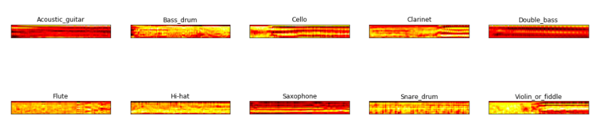

# Instrument Classifier

A machine learning classification project that predicts an instrument being played in a particular wavfile. 

## Background Information / Documentation
The neural network uses Mel Cepstrum Coefficients (MFCCs) to distinguish between various instrument sounds. As shown below, each MFCC looks very different, so the model is able to differentiate between the instruments. Here are the MFCCs that were extracted in the [visualization notebook](https://github.com/lauradang/audio-classification/blob/master/visualizing.ipynb).

Detailed notes and background information can be found on my [Gitbook](https://lauradang.gitbook.io/notes/machine-learning/machine-learning-audio-classification).

## Results
The model reaches a 97.3% validation accuracy.

## Steps to Run
1. Install dependencies using `pip install -r requirements.txt`.
2. Raw wavfiles can be found in seth814's Github [repo](https://github.com/seth814/Audio-Classification/tree/018692a618ed4c3f9b9af7467a8246fc4fbaf1bb).
3. Run `visualizing.ipynb` Jupyter Notebook to produce a directory that contains the cleaned wavfiles. Change constants as needed.
4. Run `prepare_data.py` to produce a directory with the prepared training data as pickles. Run `python3 prepare_data.py -h` for instructions on how to run the script.
5. Run `train.py` to train the data on the model and produces a `saved_models` directory with the CNN saved. Run `python3 train.py -h` for instructions on how to run the script.

## Mainly Built With
* [Scipy](https://docs.scipy.org/doc/scipy-0.14.0/reference/index.html) - For retrieving audio samples
* [Tensorflow - Keras](https://www.tensorflow.org/guide/keras) - Used to create CNN
* [python_speech_features](https://python-speech-features.readthedocs.io/en/latest/) - Extracting MFCCs for training data
